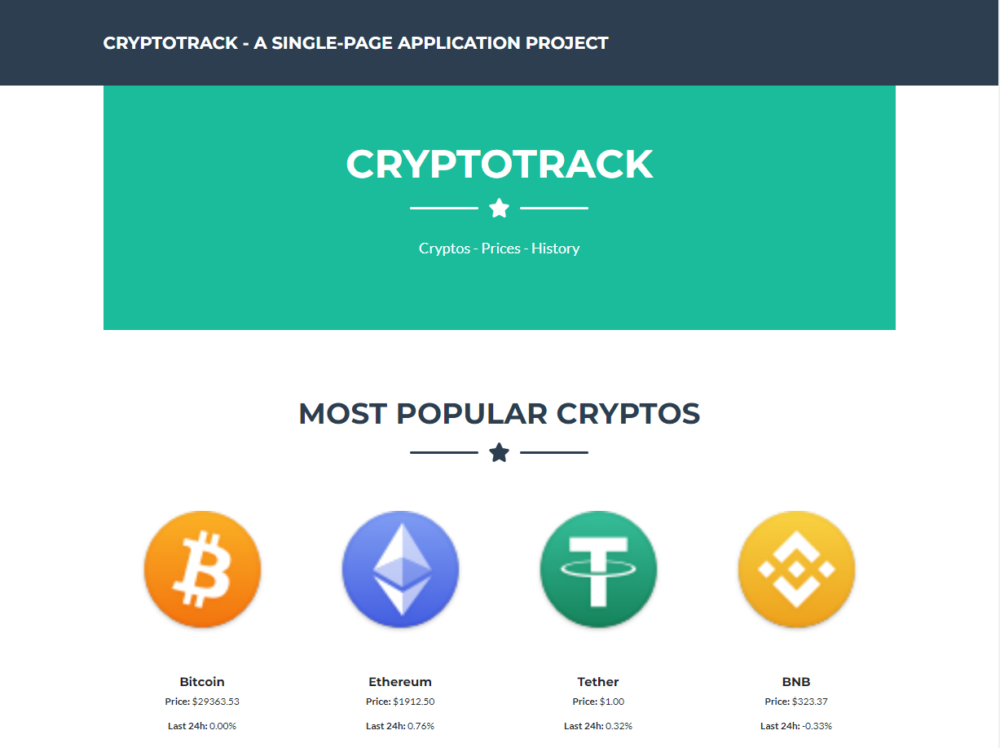
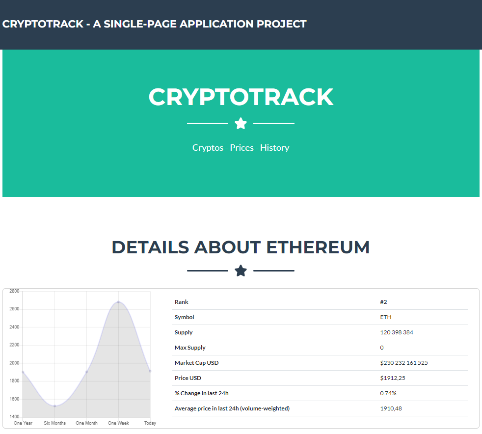

# CryptoTrack

CryptoTrack is a single page application that allows users to keep track of major cryptocurrencies and view details such as current prices, price variations, trade volume, and more.

This project was built during my attendance at Academia de Códigos 14-week Intensive Full Stack bootcamp and utilizes API calls to retrieve current cryptocurrency data.

## Technologies

CryptoTrack was built using the following technologies:

- Frontend: HTML5, CSS3, Bootstrap, JavaScript, jQuery, Chart.js

## Screenshots

You can find screenshots of the main page and the specific coin page below:

### Main Page

### Specific Coin Page

## Getting Started

To check out CryptoTrack, please visit the following link: https://cryptotrack-ba57.onrender.com/

## Credits

CryptoTrack was built by Ricardo Gago.

## License

CryptoTrack is released under the [MIT License](https://opensource.org/licenses/MIT).

---

THANKS
- To all the good and ingenious folk who have helped me get here and provide us with the tools to make the world a better place, one line at a time :)

TECHNOLOGY COLOPHON
- CSS3, HTML5, Bootstrap, JavaScript, jQuery, Modernizr, Normalize
